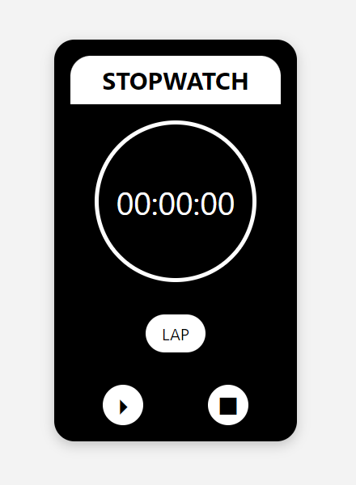

# Interactive Stopwatch Web Application ⏱️

Welcome to **PRODIGY_WD_02**, a dynamic and interactive stopwatch web application designed for precise time management and user-friendly interaction. This project is built using HTML, CSS, and JavaScript, offering a seamless experience for users who need to track time with accuracy and simplicity.

## 🌟 Project Overview

This stopwatch web application allows users to:

- **Start, Pause, and Reset** the stopwatch with intuitive controls.
- **Track and Display Lap Times** to measure specific intervals accurately.
- **Experience a Smooth User Interface** that is both functional and aesthetically pleasing.

By leveraging HTML for structure, CSS for styling, and JavaScript for interactivity, this project exemplifies modern web development practices in a simple yet powerful tool.

## 🛠️ Features

- **Responsive Design**: The stopwatch adapts to various screen sizes, ensuring a consistent experience across devices.
- **Interactive Controls**: Start, pause, and reset functions are easily accessible and responsive.
- **Lap Time Tracking**: Users can record multiple lap times, which are displayed in real-time.

## 📂 Project Structure

```graphql
├── index.html          # Main HTML structure
├── styles.css          # CSS styling for the stopwatch
├── script.js           # JavaScript for stopwatch functionality
└── assets/             # Folder for any additional assets (e.g., images, icons)
```

## 🚀 Getting Started

To get this stopwatch up and running on your local machine, follow these simple steps:

1. **Clone the repository**:
   ```bash
   git clone https://github.com/Mayur-Mhatre/PRODIGY_WD_02.git
   ```
2. **Navigate to the project directory**:
   ```bash
   cd PRODIGY_WD_02
   ```
3. **Open `index.html`** in your preferred web browser.

## 🔧 How It Works

- **HTML**: Structures the layout of the stopwatch, including buttons and display areas.
- **CSS**: Styles the stopwatch for a clean, responsive interface.
- **JavaScript**: Implements the logic for starting, pausing, resetting, and tracking lap times.

## 🎨 Screenshots

  
*Example of the stopwatch interface.*

## 📝 License

This project is licensed under the **GPL-3.0 License**. See the [LICENSE](LICENSE) file for more details.

## 🙌 Acknowledgements

- Developed as part of the PRODIGY Web Development Series.
- Inspired by the need for simple, effective time-tracking tools.

## 👤 About the Author

**Mayur Mhatre**

- **GitHub**: [Mayur-Mhatre](https://github.com/Mayur-Mhatre/)
- **LinkedIn**: [Mayur Mhatre](https://www.linkedin.com/in/mayurmhatre/)

Feel free to reach out or connect if you have any questions or suggestions!

---

Thank you for checking out **PRODIGY_WD_02**! Contributions, feedback, and suggestions are always welcome. Let's build something great together!
